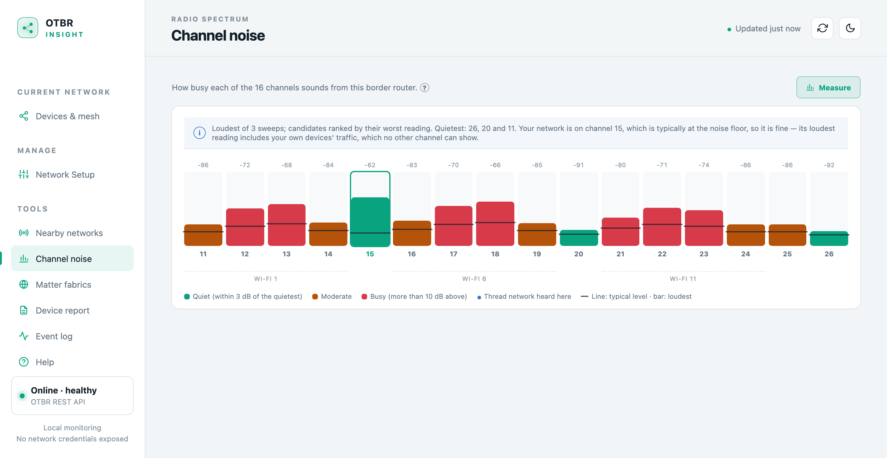
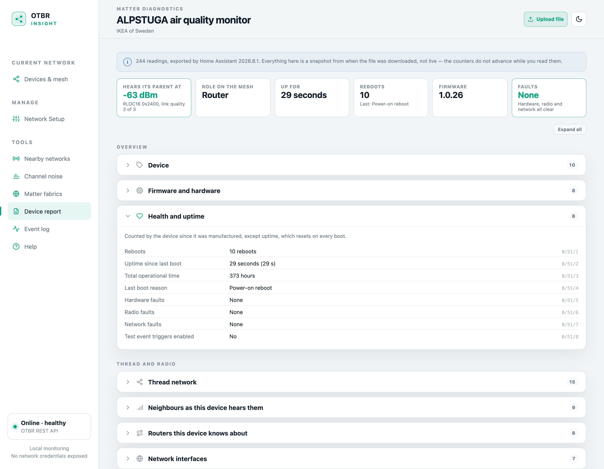
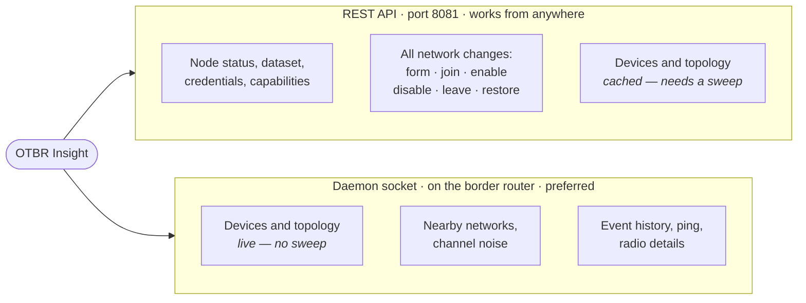

# OTBR Insight

OTBR Insight is a monitoring and management dashboard for an [OpenThread Border Router](https://openthread.io/guides/border-router) (OTBR). It is a single Go binary with no runtime dependencies: it polls the OTBR REST API, normalizes the version-dependent responses, and serves an embedded web interface.

It has **two modes**. Pointed at an OTBR over the network it uses the REST API alone and runs anywhere. Running **on the border router itself** it can additionally read OpenThread's daemon socket, which supplies live mesh data, nearby-network scanning, runtime radio details, event history, and reachability testing — none of which the REST API exposes. See [Data sources](#data-sources).

## Highlights

- Mesh map with per-device signal, link quality and last-seen
- Device names you assign once, used everywhere
- Two-hour signal history per device, gaps included
- Event log from OpenThread's own recorder
- Reachability testing from the border router
- Channel noise measurement, graded and Wi-Fi aware
- Nearby Thread network scan
- Matter fabric discovery over mDNS
- Home Assistant diagnostics decoder: ~250 readings per device, named
- Built-in MCP endpoint: twelve tools for an assistant
- Form, join, enable, disable, leave and restore the network
- Thread terms explained where they appear

Full list under [Features](#features).


*The mesh view — one cluster per router, with signal strength and last-seen on every card. Populated here with synthetic data; the identifiers are documentation values, not a real network.*

## Features

**Monitoring**

- Mesh map of routers, end devices and their parent links, with an inspector per node
- Searchable device list: role, RLOC16, parent by name, signal, retry rate, last seen
- Device names you assign once, shown on the map, the list and the event log
- Network identity, border-router runtime, RCP radio and IPv6 details in collapsible panels
- Live status — online, network disabled, stale, or OTBR offline — keeping the last good snapshot while OTBR is unreachable
- Live mesh over the daemon socket: devices appear and vanish as they attach, no sweep and no stale cache. Over REST alone a periodic sweep is posted instead
- Per-device link health: signal, link margin and frame/message retry rates, flagged when a link is straining
- Two-hour signal history per device, with gaps where the device was absent, so an intermittent link reads differently from a steadily weak one. Memory only, so it starts empty after a restart
- Event log from OpenThread's own recorder, covering time before the dashboard was running
- Reachability testing from the border router, which reaches mesh-local addresses a browser cannot
- Nearby Thread networks: three discovery passes merged, since a single pass hears a given neighbour only about half the time
- Channel noise: ~10 s of repeated sweeps, graded against the quietest channel, with Wi-Fi overlap marked



*Bar is the loudest reading, line the typical one. Grading is relative to the quietest channel in the same scan, because the two measurement paths disagree by 15 dB. Synthetic measurements.*

- What each device advertises via SRP: whether it is registered at all — the difference between "on the mesh" and "visible to controllers" — its Matter node ID per fabric, and whether a commissioning window is open right now
- Matter fabrics on the LAN over mDNS, labellable, working even with an empty mesh since Wi-Fi Matter devices advertise too
- A device report from a Matter diagnostics export: ~250 readings named and given their units — battery, reboots, the device's own Thread counters, how it hears its parent, certificates decoded rather than printed. Nothing in the file is dropped



*Headline stats answer "is this device all right"; the rest is below, banded. From a sanitised export; the identifiers are documentation values.*

- Fabric identification from the same export. A fabric ID is a hash, and a browse sees only controllers that are advertising — but a device's root certificates name every fabric it belongs to, including ones nothing on the LAN is advertising. Decoded and discarded; nothing is stored
- Built-in Thread guide, with terms like RLOC16 and OMR addressing explained where they appear
- Dark and light themes, responsive down to tablet width

**Management** (Network Setup view)

- Form a network with locally generated credentials
- Join one from its credentials, or by pasting an operational dataset TLV from another border router
- Enable, disable, or leave the network
- Automatic backup of the previous dataset before every destructive change, with one-click restore
- Reveal the network key, PSKc and dataset TLV on demand

Every destructive action is confirmed in a dialog before it is sent.

**Assistant access** — a built-in MCP server at `/mcp` with twelve tools, no extra process. See [Assistant access (MCP)](#assistant-access-mcp).

## Security model

Read this before exposing the dashboard.

- **There is no authentication.** Anyone who can reach the listen address can view the network and, through the Network Setup view or the API, change it. Bind to a trusted LAN interface, or put a reverse proxy with authentication in front of it. This matches the posture of OTBR's own web UI.
- **Cross-site requests are rejected.** Browsers attach `Origin` and `Sec-Fetch-Site` headers to cross-origin writes; the server refuses any write whose origin is not its own, and requires JSON bodies to declare `Content-Type: application/json`. This stops a web page you happen to visit from re-forming your Thread network. Non-browser clients such as `curl` send neither header and are allowed.
- **Reverse proxies must forward the host.** The origin check compares against the `Host` header, or `X-Forwarded-Host` when present. With nginx, set `proxy_set_header Host $host;` or writes from the browser will be refused.
- **Credentials stay off the polled path.** The network key and PSKc are masked in every continuously refreshed response. They are served only by `GET /api/v1/network/credentials`, which the UI calls when you press Reveal, and they are never logged.
- **The backup file holds the network key in plaintext.** It lives at `<data-dir>/dataset-backup.json`. Protect the data directory accordingly; the sample systemd unit keeps it under `/var/lib/otbr-insight` via `StateDirectory`.
- **The MCP endpoint shares this posture.** `/mcp` is unauthenticated like the rest of the API. It exposes read tools and a ping; it cannot form, join or leave a network, and it never returns credentials. See [Assistant access (MCP)](#assistant-access-mcp).
- **The app never executes a command.** It runs no subprocess: no `ot-ctl`, no shell. It cannot factory-reset the router or commission devices with a PSKd.
- **It does speak the daemon socket protocol directly** when `--otbr-socket` points at a live socket. That is the same channel `ot-ctl` uses, and everything the app sends over it is listed under [Data sources](#data-sources) — reads, one active scan, and one ping. It sends no command that changes network configuration; all such writes go over REST.
- **Socket access needs privilege.** `otbr-agent` creates the socket mode `0755 root:root`, and `connect()` requires write access, so only root can open it. The sample unit therefore runs as root, which means an unauthenticated service is driving a root process — see the notes in the unit file for the alternatives.

## Installation

Prebuilt Linux binaries for `amd64` and `arm64` are attached to each [GitHub release](https://github.com/sumitbirla/otbr-insight/releases). Pick the one for the OTBR host's architecture (`uname -m` reports `x86_64` for amd64 and `aarch64` for arm64), download it, and install it:

```sh
curl -fsSLO https://github.com/sumitbirla/otbr-insight/releases/latest/download/otbr-insight-linux-arm64
sudo install -m 0755 otbr-insight-linux-arm64 /usr/local/bin/otbr-insight
```

A `SHA256SUMS` file accompanies each release for verification. No Node.js, Python, database, or other runtime is required; the binary is static with the web assets embedded.

Releases are cut by pushing a `v*` tag; the workflow in [.github/workflows/release.yml](.github/workflows/release.yml) runs the tests, builds both binaries, and publishes them.

## Running

```sh
otbr-insight --otbr-url http://127.0.0.1:8081 --listen :8088
```

Then open `http://<otbr-host>:8088` from a device on the trusted LAN. `otbr-insight -h` prints every flag with its effective default.

## Configuration

Each option can be set by flag or environment variable. Flags take precedence.

| Flag | Environment variable | Default | Description |
| --- | --- | --- | --- |
| `--listen` | `OTBR_INSIGHT_LISTEN` | `:8088` | HTTP listen address |
| `--otbr-url` | `OTBR_INSIGHT_OTBR_URL` | `http://127.0.0.1:8081` | OTBR REST API base URL |
| `--poll-interval` | `OTBR_INSIGHT_POLL_INTERVAL` | `5s` | How often to poll node status (minimum 1s). Devices and topology poll at 3× this with a 15s floor over REST, or at this same interval when the daemon socket supplies them |
| `--discovery-interval` | `OTBR_INSIGHT_DISCOVERY_INTERVAL` | `5m` | How often to ask OTBR to rediscover the mesh; `0` disables, minimum 30s. Skipped entirely while the daemon socket is supplying live data |
| `--otbr-socket` | `OTBR_INSIGHT_OTBR_SOCKET` | `/run/openthread-wpan0.sock` | OpenThread daemon socket; empty disables. Only usable on the border router host |
| `--log-level` | `OTBR_INSIGHT_LOG_LEVEL` | `info` | `debug`, `info`, `warn`, or `error` |
| `--data-dir` | `OTBR_INSIGHT_DATA_DIR` | see below | Directory for device names and the dataset backup; empty disables both |

The OTBR URL must be `http` or `https` and must not contain credentials, a query, or a fragment.

**Data directory.** When not set explicitly, the app uses systemd's `STATE_DIRECTORY` if present, otherwise the user configuration directory (for example `~/.config/otbr-insight` on Linux). It holds two files: `names.json` and `dataset-backup.json`.

**Optional runtime details.** Some values live in neither the REST API nor the dataset: RCP version, transmit power, WPAN service state, link-local address, and the nearby-network scan. Two sources can supply them — OTBR's own web service (`otbr-web`, normally port 80 beside the REST API on 8081) and the daemon socket. The socket is preferred when available; otherwise, if the REST URL uses port 8081, the app scrapes otbr-web on port 80 or 443. With neither, those fields are simply absent and the network scan reports itself unavailable. Channel, PAN ID, and extended PAN ID are always shown, taken from the active dataset.

## Data sources

Everything comes from one of two channels. The REST API works from anywhere. The daemon socket is a UNIX socket, so it only works when otbr-insight runs **on the border router itself** — and where both can answer, the socket wins, because its data is live rather than cached.



**All network changes go over REST**, including when the socket is present: writes stay on the documented API. The socket is read-only apart from scanning.

Without the socket, `otbr-web` on port 80 can stand in for the nearby-network scan and the runtime radio details, if it is running — see *Optional runtime details* above. It cannot stand in for the event history or the reachability ping: those exist only over the socket.

### Costs worth knowing

- **Scanning takes the radio off channel**, and the border router cannot serve its children while it is away. A whole-band `discover` is 4.9 s away without a break — long enough for sleepy children to give up and re-attach to another router. Discovery is therefore issued one channel at a time (0.3 s each) with a pause at home between them, and energy sweeps are 0.1 s each, so no absence outlasts a poll retry.
- **The energy scan uses the firmware's default dwell only.** A 500 ms dwell hung the radio co-processor on the reference router (Silicon Labs EFR32 on an SMLIGHT SLZB-07) — `otbr-agent` aborted and only a power cycle recovered it. There is no way to lengthen it. To see past a single snapshot the app repeats the safe sweep for about ten seconds instead, keeping the loudest and median per channel.
- **The daemon serves one client at a time.** A new connection displaces the previous one, taking any pending output with it. So a long `ot-ctl` command run by hand while the app is polling will usually lose its results — stop the service, or use the app's own scan, history and ping.
- **`meshdiag` queries cost radio time**, so they are cached for 30 seconds. Ages and signal come from local tables on every poll and cost nothing.

## Running with systemd

A hardened sample unit is provided at [deploy/otbr-insight.service](deploy/otbr-insight.service), with a private state directory and `ProtectSystem=strict`.

It runs as **root**, because the daemon socket is `0755 root:root` and cannot otherwise be opened. If you do not need the socket features, switch to `DynamicUser=yes` and everything in the REST column above keeps working. The unit file documents both, plus a middle option that grants a group instead.

```sh
sudo cp deploy/otbr-insight.service /etc/systemd/system/
sudo systemctl daemon-reload
sudo systemctl enable --now otbr-insight
sudo systemctl status otbr-insight
```

Adjust `ExecStart` if OTBR listens on a different address or port.

## Building from source

Go 1.26 or newer is required, which is what `go.mod` declares.

```sh
make test       # go test ./...
make build      # local binary at dist/otbr-insight
make release    # linux-amd64 and linux-arm64 binaries in dist/
```

Frontend assets in `web/static/` are embedded with `go:embed`; there is no separate frontend build, but a rebuild is needed to pick up changes to them.

## Internal API

The browser talks only to this API; it never contacts OTBR directly. Responses are JSON wrapped in `{"data": ...}` unless noted.

**Read**

| Endpoint | Description |
| --- | --- |
| `GET /api/v1/overview` | Normalized node status with freshness and health metadata |
| `GET /api/v1/devices` | Device inventory with user names overlaid as `customName` |
| `GET /api/v1/topology` | Router adjacency and child attachments from network diagnostics |
| `GET /api/v1/capabilities` | Which optional OTBR endpoints this build supports |
| `GET /api/v1/networks` | On-demand scan for nearby networks: three passes merged over the socket (~25 s), one otbr-web scan otherwise; `passes` says which |
| `GET /api/v1/channels` | Energy scans over about ten seconds: `sweeps`, `currentChannel`, and `channels[]` of `{channel, maxRssi, typicalRssi}` |
| `GET /api/v1/fabrics` | Matter nodes on the LAN grouped by fabric, merged with the mesh devices' SRP registrations. About three seconds |
| `POST /api/v1/fabrics/identify` | Decodes a Matter diagnostics export (body: the JSON file) into the fabrics the device belongs to, plus `report`: every attribute named and given its units. Read once and discarded |
| `PUT /api/v1/fabrics/{id}/name` | Labels a Matter fabric (body `{"name": "Home Assistant"}`) |
| `DELETE /api/v1/fabrics/{id}/name` | Removes a fabric label |
| `GET /api/v1/network` | Interface state and the credential-masked active dataset, plus backup metadata |
| `GET /api/v1/network/credentials` | The unmasked network key, PSKc, and dataset TLV |
| `GET /api/v1/devices/{ext}/signal` | Two-hour signal trail in one-minute buckets: mean, min and max RSSI, and whether the device was present |
| `GET /api/v1/history` | OpenThread's recorded role, partition, and neighbour events, with user names overlaid; needs the daemon socket |
| `GET /api/v1/health` | `{"status", "apiHealth"}`; returns 503 when OTBR is offline and no snapshot has ever been received |
| `POST /mcp` | Model Context Protocol endpoint; see [Assistant access (MCP)](#assistant-access-mcp) |

**Write** (same-origin or non-browser clients only; JSON bodies require `Content-Type: application/json`)

| Endpoint | Body | Description |
| --- | --- | --- |
| `POST /api/v1/network/form` | `{"networkName", "channel"?, "panId"?}` | Form a new network with generated credentials |
| `POST /api/v1/network/join` | `{"networkName", "networkKey", "channel"?, "panId"?, "extPanId"?, "pskc"?, "meshLocalPrefix"?}` | Join from credentials |
| `POST /api/v1/network/join/tlv` | `{"tlv"}` | Join from an operational dataset TLV (hex) |
| `PUT /api/v1/network/state` | `{"enabled": true\|false}` | Enable or disable the Thread interface |
| `DELETE /api/v1/network` | — | Disable the interface and clear the active dataset |
| `POST /api/v1/network/restore` | — | Re-apply the backed-up dataset |
| `PUT /api/v1/devices/{ext}/name` | `{"name"}` | Set a device name by extended address |
| `DELETE /api/v1/devices/{ext}/name` | — | Clear a device name |
| `POST /api/v1/devices/{address}/ping` | — | Reachability test from the border router. A POST because it transmits, though it changes nothing; tens of seconds against a sleepy device |

Errors carry `{"error": "..."}`. Invalid input returns 400, a cross-site request 403, a wrong content type 415, an OTBR rejection 409 or 502, an OTBR timeout 504, and an unreachable OTBR 502. Every network change is preceded by a dataset backup and followed by an immediate status refresh.

## Assistant access (MCP)

The binary serves a [Model Context Protocol](https://modelcontextprotocol.io) endpoint at `/mcp`, on the same port as the dashboard. An MCP client such as Claude connects to it and gets the mesh as a set of tools, so questions like *"why does the porch sensor keep dropping off?"* can be answered by reading the device list, the event history and a ping from the border router, in the same conversation. Nothing extra runs: it is the same process, reading the same snapshots the dashboard shows.

### Connecting

The endpoint is `http://<host>:8088/mcp` (adjust for `--listen`). It uses the Streamable HTTP transport in stateless mode, which every current MCP client supports as a "remote" or "HTTP" server.

Claude Code:

```sh
claude mcp add --transport http otbr-insight http://openthread-br.local:8088/mcp
```

Claude Desktop's "Add custom connector" accepts only `https://` URLs, since it is meant for servers on the internet; a LAN server goes in `claude_desktop_config.json` instead, as a local command that bridges stdio to the URL (for example `npx mcp-remote http://openthread-br.local:8088/mcp --allow-http`). Clients configured through a JSON file, such as a project `.mcp.json`:

```json
{
  "mcpServers": {
    "otbr-insight": {
      "type": "http",
      "url": "http://openthread-br.local:8088/mcp"
    }
  }
}
```

No token or header is required. The client must be on the same LAN as the dashboard, or reach it through whatever proxy you already use for the web UI.

### Available tools

| Tool | Arguments | Returns | Needs |
| --- | --- | --- | --- |
| `get_network` | — | Identity, border-router state, leader and partition, whether a dataset and a restore point exist, and **device counts** — not the device list, so it stays cheap to call first | REST |
| `list_devices` | `role`, `query` | Per device: name, extended address, role, parent **by name**, age, RSSI, link quality and margin, error rates, addresses, and what it registered with SRP | REST; live with the socket |
| `get_topology` | — | Routers with their children, router-to-router links with quality and path cost, and any children whose parent could not be resolved | REST; live with the socket |
| `get_history` | `device`, `limit` | OpenThread's event log, newest first: role and partition changes, attachments and departures, with the signal at the time | Socket |
| `get_signal_history` | `device` | Mean, best and worst RSSI over about two hours, how much of the window the device was present, reduced to at most 24 points | In-memory trail |
| `scan_networks` | — | Other Thread networks on the air: name, extended PAN ID, PAN ID, channel | Socket or `otbr-web` |
| `scan_channels` | — | Per channel: loudest and typical level, graded against the quietest, Wi-Fi overlap, and an assessment of the current one. About ten seconds | Socket or REST |
| `list_fabrics` | — | Matter fabrics with nodes on the LAN, mesh devices named and flagged. About three seconds | mDNS, plus SRP with the socket |
| `get_capabilities` | — | Which optional OTBR endpoints this firmware supports, with the last probe's status and latency — to tell a missing feature from a transient failure | REST |
| `ping_device` | `device`, `count` | Sent and received counts, min/average/max round trip, and which address was used. Prefers the mesh-local address, which survives roaming | Socket |
| `set_device_name` | `device`, `name` | Stores a local label for a device. Empty clears it | Local name file |
| `set_fabric_name` | `fabric`, `name` | Stores a local label for a Matter fabric. `fabric` is the full 16-hex compressed ID | Local name file |

The last two are the only tools that write, and they write to the dashboard's own label file rather than to the network. All twelve are always listed: when a source is unavailable, the tool returns the reason in words the model can relay, not a protocol failure.

A device can be named any way the dashboard shows it — a label (case-insensitively, by unique substring), an extended address, an RLOC16 like `0x0401`, or a bare IPv6 address. When nothing matches, the error says so and points at `list_devices`.

### What the results look like

`list_devices` returns one entry per device, shaped like this (identifiers are documentation values):

```json
{
  "name": "Porch button",
  "extendedAddress": "0203040506070809",
  "role": "child",
  "rloc16": "0x0805",
  "parent": "Hallway plug",
  "lastSeenSeconds": 10,
  "rssi": -91,
  "linkQuality": 1,
  "linkMargin": 9,
  "frameErrorRate": 0.3384,
  "messageErrorRate": 0.043,
  "meshLocalAddress": "fdde:ad00:beef:0:c104:8c20:72de:23db",
  "omrAddress": "fd11:2233:4455:1:e296:4b34:a94d:5ee8"
}
```

Those fields already tell the story: a child at the edge of range attached to a router rather than the border router, with a third of its frames needing a retry.

The shapes are deliberately not the REST payloads — names replace hex, parents are named, timestamps become ages, and topology is nested by router. Every tool also returns a structured result alongside the text, so clients using output schemas get typed fields, and the instructions sent on connect give the model the reading conventions: what counts as a weak RSSI, that error rates are a rolling average over roughly the last 64 frames, and that a sleepy device answering a ping late is normal.

### What is deliberately missing

- **No network writes.** Form, join, leave, enable, disable and restore are not exposed. In the UI every one of them sits behind a confirmation dialog, and a tool call is a single click by another name. If an assistant needs to change the network, it can tell you what to click.
- **No credentials.** The network key, PSKc and dataset TLV are not served by any tool, in keeping with the rule that credentials never appear on a read path.
- **Nothing beyond the label file.** The two naming tools write to the dashboard's own names file and nothing else. `ping_device` makes the radio transmit but changes no state. That is the whole write surface.

### Security

The endpoint has the same posture as the rest of the API: no authentication, trusted LAN only. In practice it exposes less than the dashboard does: it cannot change the Thread network or reveal credentials, and the only state it can write is a local label. A few specifics:

- Cross-site POSTs are rejected the same way as the REST writes, so a web page cannot use your browser to query the endpoint. Non-browser clients pass.
- `GET /mcp` returns 405. The server is stateless, so there is no session to hijack and no server-to-client stream to leave open.
- Behind a reverse proxy, forward the request as-is; the endpoint does not depend on `Host` and imposes no origin check of its own beyond the cross-site rule above.

### Troubleshooting

- **Client reports 403.** The request carried a browser `Origin` from another site. MCP clients do not send one; if a proxy is adding headers, remove them for `/mcp`.
- **`ping_device` or `get_history` says it needs the daemon socket.** The socket is not present on this host; both work only when otbr-insight runs on the border router. See [Data sources](#data-sources).
- **`get_history` or `ping_device` returns "permission denied".** The socket exists but the process cannot open it; only root can, see the systemd notes above.
- **A ping takes a long time.** Sleepy end devices answer only when they next wake. The tool waits up to 60 seconds.

## OTBR compatibility notes

- **Transmit power is not persistent.** `ot-ctl txpower` writes only to the radio co-processor, so an agent restart or a radio reset silently returns it to the firmware default (0 dBm on an SMLIGHT SLZB-07). Children pick the router they hear loudest and re-evaluate only when they hear their parent poorly, so a border router that drops 5 dB quietly loses its children to any other router. Re-apply the value on every start with a systemd drop-in: an `ExecStartPost` on `otbr-agent.service` that retries `ot-ctl txpower <dBm>` until the daemon socket answers.

The adapter normalizes several OTBR REST API variants. Behaviour observed on real firmware that shaped the design:

- Node status is read from `/api/node` with a fallback to the legacy `/node`. Some builds serve a stale `/api/node` after a dataset change, so live fields from `/node` are overlaid on top.
- `/api/devices` and `/api/diagnostics` are caches that OTBR fills only when asked — it runs no discovery of its own. Left alone they freeze indefinitely: one border router was observed serving a 45-day-old device list. Over REST the app posts a device-collection sweep plus a per-router diagnostic query at startup and every `--discovery-interval`. With the daemon socket it reads the mesh directly instead and skips the sweeps entirely.
- The REST action list offers no active network scan. `getEnergyScanTask` is an energy-detect scan reporting RSSI per channel, not the networks on air, so nearby-network scanning needs either otbr-web or the daemon socket.
- Error rates are a rolling average over roughly the last 64 transmissions to a neighbour, not a total, and they **reset when a device attaches**. A device that has just joined or roamed reports a near-zero rate that climbs for several minutes; read them alongside the attach events in the Event log view.
- Changing the active dataset requires disabling the interface first. The app always performs disable, write, enable as one serialized operation.
- Leaving a network is implemented as disable plus delete-dataset. A true factory reset needs `ot-ctl`, which the app deliberately does not use.

## Tools

`tools/screenshots` regenerates the images this README embeds. They are captured from the real application — real assets, real CSS, the real decoder — with only the *data* substituted: a published mesh view would carry the network's name, PAN ID and every device's extended address, and a real energy scan takes the border router off channel for ten seconds, which is a reasonable thing to do when someone presses the button and an unreasonable thing to do as a build step. `./tools/screenshots/capture.sh` starts its own instance and a headless Chrome, drives them over the DevTools Protocol from a dependency-free Node script, and cleans up after itself. See [its README](tools/screenshots/README.md).

`tools/matter-xref` is a standalone command, not part of the server, that matches Matter node IDs to mesh devices. A commissioned Matter device advertises `_matter._tcp` over mDNS with its Thread extended address as the hostname, which is the key OTBR Insight uses for devices. The server now does the same browse itself (the Matter fabrics panel and `GET /api/v1/fabrics`); the tool predates that and remains as a LAN-side check, shelling out to `dns-sd` (macOS) or `avahi-browse` (Linux):

```sh
go run ./tools/matter-xref -api http://127.0.0.1:8088
```

## Limitations

- One border router per instance; no multi-OTBR view.
- Event history is OpenThread's own fixed-size log, held in memory: it is cleared whenever `otbr-agent` restarts, and the app does not record its own.
- No commissioning. Adding a device with a PSKd needs the commissioner, which is not implemented.
- OTBR builds without the device collection or diagnostics endpoints show only the local border router.
- Child devices are matched to the inventory by extended address only when the firmware's diagnostic `children` TLV reports one; older firmware falls back to a derived identifier that is stable only within one snapshot, and those children cannot be named.
- Nearby-network scans require either the daemon socket or OTBR's web service. Over the socket they report network names and extended PAN IDs; via otbr-web those fields are often absent.
- The MCP endpoint has no authentication of its own. It reads, apart from `ping_device`, which transmits but changes nothing, and the two naming tools, which write a label to the dashboard's own file. An assistant can diagnose the Thread network and record what it found, but not change the network.

## Architecture

```
OTBR REST API  ─┐                                                          ┌→ web/static  (dashboard)
                ├→ internal/otbr (Client) → internal/service (Monitor) → internal/api ┤
daemon socket  ─┘   via internal/otctl                                     └→ internal/mcpserver  (/mcp)
```

`internal/model` is the normalized contract shared by every layer. The OTBR client implements `service.ThreadProvider`. `internal/otctl` is injected into it through small optional interfaces — mesh reader, scanner, status reader, history reader, pinger — so `internal/otbr` never imports it and an absent socket simply means absent capability. `internal/mcpserver` sits beside the REST handlers on the same mux and reads the same snapshots and name store, reshaping them for a language model; it is one of two places the module takes a dependency, on the official MCP Go SDK; the other is `internal/mdns`, a one-shot multicast DNS browser on `golang.org/x/net`'s wire-format parser, which `internal/matter` uses to group Matter nodes by fabric. `internal/names` and `internal/backup` are the only persistent state.

## License

[MIT](LICENSE)
