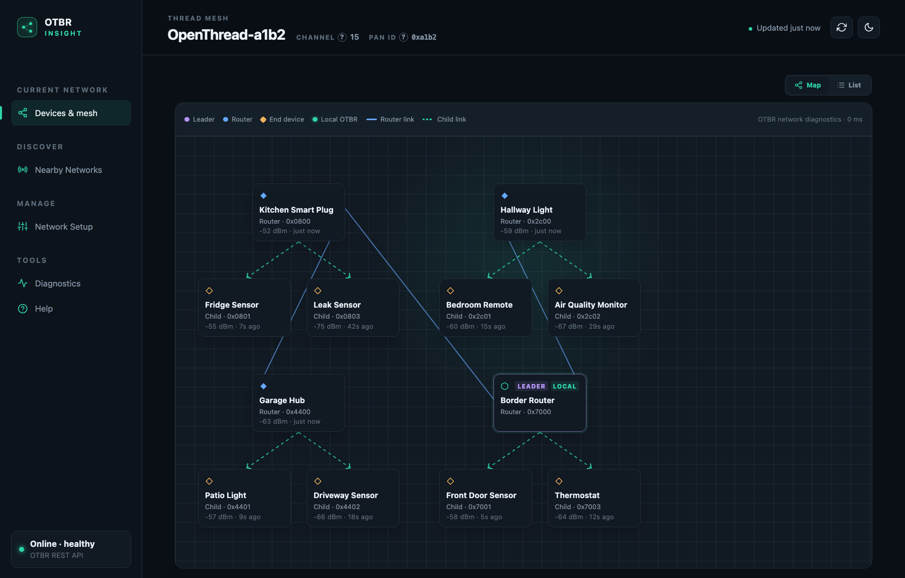

# OTBR Insight

OTBR Insight is a monitoring and management dashboard for an [OpenThread Border Router](https://openthread.io/guides/border-router) (OTBR). It is a single Go binary with no runtime dependencies: it polls the OTBR REST API, normalizes the version-dependent responses, and serves an embedded web interface.

It has **two modes**. Pointed at an OTBR over the network it uses the REST API alone and runs anywhere. Running **on the border router itself** it can additionally read OpenThread's daemon socket, which supplies live mesh data, nearby-network scanning, runtime radio details, event history, and reachability testing — none of which the REST API exposes. See [Data sources](#data-sources).

It shows the Thread mesh as a map and a list, lets you name devices, scans for nearby Thread networks, and can form, join, enable, disable, leave, and restore the Thread network on the border router. It also serves a [Model Context Protocol](https://modelcontextprotocol.io) endpoint, so an AI assistant can read the same mesh data and help diagnose it — see [Assistant access (MCP)](#assistant-access-mcp).



*The mesh view — one cluster per router, with signal strength and last-seen on every card. Populated here with synthetic data; the identifiers are documentation values, not a real network.*

## Why this exists

OTBR already ships with a web UI, `otbr-web`. This project started because that one was hard to understand.

The difference is one of purpose rather than quality. `otbr-web` is a task tool for someone who already knows Thread: its endpoints are `form_network`, `join_network`, `commission`, `add_prefix`, `delete_prefix`, and the ePSKc controls. You go there to *do* a specific thing you already know you need to do, and it does those things well.

What it cannot do is tell you about your network. Its entire read surface is two endpoints — `get_properties`, which describes the border router itself, and `available_network`, which scans the air for other networks. **Neither returns the devices on your own mesh.** There is no device list, no topology, no link quality, no history. If you want to know which of your sensors is attached, to what, how well, or when it last dropped off, the shipped UI has no answer, because it never asks the question.

The rest follows from that gap:

- **Devices have names.** A Thread device identifies itself as `0203040506070809`. You assign it a label once and it appears everywhere — map, list, event history — instead of you memorising hex.
- **The mesh is drawn, not just listed.** Routers, their children, and which parent each device attached to, which is the thing that actually explains behaviour.
- **Terms are explained in place.** RLOC16, partitions, OMR addressing, link margin: each has a `?` beside it, plus a short Thread guide built in. The vocabulary is the main barrier to understanding a Thread network, and hiding it behind a glossary elsewhere does not help.
- **Values are given meaning.** Not just a signal number, but whether a link is straining; not just a device list, but which entries may be stale and why.
- **State separates from history.** OpenThread records role changes, attachments and departures; the Diagnostics view surfaces them, so "it dropped off last night" is answerable.

`otbr-web` remains the tool for what it does. Commissioning a device with a PSKd or a QR code, managing on-mesh prefixes, and the ePSKc flow are all implemented there and deliberately **not** here. The two can run side by side; if you keep `otbr-web` for commissioning, note that this app will also use its `available_network` and `get_properties` endpoints when the daemon socket is unavailable.

## Features

**Monitoring**

- Mesh map of routers, end devices, and their parent links, built from OTBR network diagnostics, with a device inspector for each node
- Searchable device list with role, RLOC16, extended address, OMR IPv6 address, link metrics, and last-seen time
- User-assigned device names, persisted locally and shown on both the map and the list
- Network identity, border-router runtime, RCP radio, and IPv6 details in collapsible panels
- Live status: online, network disabled, stale data, or OTBR offline, with the last valid snapshot kept while OTBR is unreachable
- Live mesh data when the daemon socket is available: devices appear and disappear as they attach, with no discovery sweep and no stale cache. Over REST alone, a periodic sweep is posted instead
- Per-device link health: signal, link margin, and frame/message retry rates, flagged when a link is straining
- Diagnostics view of OpenThread's own event history — attachments, departures, role and partition changes — covering time before the dashboard was running
- Reachability testing from the border router, which can reach mesh-local addresses a browser cannot
- On-demand scan of nearby Thread networks with the current network highlighted
- Built-in Thread guide and contextual explanations for terms such as RLOC16, partitions, and OMR addressing
- Dark and light themes, responsive layout for desktop and tablet

**Management** (Network Setup view)

- Form a new network with locally generated credentials
- Join an existing network from its credentials, optionally including the PSKc and mesh-local prefix, or by pasting an operational dataset TLV from another border router
- Enable and disable the Thread interface, or leave the network entirely
- Automatic backup of the previous dataset before every destructive change, with one-click restore
- Reveal the network key, PSKc, and dataset TLV on demand for pasting into other border routers

Every destructive action is confirmed in a dialog before it is sent.

**Assistant access** (MCP)

- Built-in Model Context Protocol server at `/mcp`, no extra process or configuration
- Six tools covering the network summary, device list, topology, event history, reachability testing, and nearby-network scan
- Results shaped for a language model: device names instead of hex, parents by name, ages in seconds, topology nested by router
- Read-only by design — no network writes and no credentials over MCP

## Security model

Read this before exposing the dashboard.

- **There is no authentication.** Anyone who can reach the listen address can view the network and, through the Network Setup view or the API, change it. Bind to a trusted LAN interface, or put a reverse proxy with authentication in front of it. This matches the posture of OTBR's own web UI.
- **Cross-site requests are rejected.** Browsers attach `Origin` and `Sec-Fetch-Site` headers to cross-origin writes; the server refuses any write whose origin is not its own, and requires JSON bodies to declare `Content-Type: application/json`. This stops a web page you happen to visit from re-forming your Thread network. Non-browser clients such as `curl` send neither header and are allowed.
- **Reverse proxies must forward the host.** The origin check compares against the `Host` header, or `X-Forwarded-Host` when present. With nginx, set `proxy_set_header Host $host;` or writes from the browser will be refused.
- **Credentials stay off the polled path.** The network key and PSKc are masked in every continuously refreshed response. They are served only by `GET /api/v1/network/credentials`, which the UI calls when you press Reveal, and they are never logged.
- **The backup file holds the network key in plaintext.** It lives at `<data-dir>/dataset-backup.json`. Protect the data directory accordingly; the sample systemd unit keeps it under `/var/lib/otbr-insight` via `StateDirectory`.
- **The MCP endpoint shares this posture.** `/mcp` is unauthenticated like the rest of the API. It exposes read tools and a ping; it cannot form, join or leave a network, and it never returns credentials. See [Assistant access (MCP)](#assistant-access-mcp).
- **The app never executes a command.** It runs no subprocess: no `ot-ctl`, no shell. It cannot factory-reset the router or commission devices with a PSKd.
- **It does speak the daemon socket protocol directly** when `--otbr-socket` points at a live socket. That is the same channel `ot-ctl` uses, and everything the app sends over it is listed under [Data sources](#data-sources) — reads, one active scan, and one ping. It sends no command that changes network configuration; all such writes go over REST.
- **Socket access needs privilege.** `otbr-agent` creates the socket mode `0755 root:root`, and `connect()` requires write access, so only root can open it. The sample unit therefore runs as root, which means an unauthenticated service is driving a root process — see the notes in the unit file for the alternatives.

## Installation

Download the executable for the OTBR host's architecture and install it:

```sh
sudo install -m 0755 otbr-insight-linux-arm64 /usr/local/bin/otbr-insight
```

No Node.js, Python, database, or other runtime is required.

## Running

```sh
otbr-insight --otbr-url http://127.0.0.1:8081 --listen :8088
```

Then open `http://<otbr-host>:8088` from a device on the trusted LAN. `otbr-insight -h` prints every flag with its effective default.

## Configuration

Each option can be set by flag or environment variable. Flags take precedence.

| Flag | Environment variable | Default | Description |
| --- | --- | --- | --- |
| `--listen` | `OTBR_INSIGHT_LISTEN` | `:8088` | HTTP listen address |
| `--otbr-url` | `OTBR_INSIGHT_OTBR_URL` | `http://127.0.0.1:8081` | OTBR REST API base URL |
| `--poll-interval` | `OTBR_INSIGHT_POLL_INTERVAL` | `5s` | How often to poll node status (minimum 1s). Devices and topology poll at 3× this with a 15s floor over REST, or at this same interval when the daemon socket supplies them |
| `--discovery-interval` | `OTBR_INSIGHT_DISCOVERY_INTERVAL` | `5m` | How often to ask OTBR to rediscover the mesh; `0` disables, minimum 30s. Skipped entirely while the daemon socket is supplying live data |
| `--otbr-socket` | `OTBR_INSIGHT_OTBR_SOCKET` | `/run/openthread-wpan0.sock` | OpenThread daemon socket; empty disables. Only usable on the border router host |
| `--log-level` | `OTBR_INSIGHT_LOG_LEVEL` | `info` | `debug`, `info`, `warn`, or `error` |
| `--data-dir` | `OTBR_INSIGHT_DATA_DIR` | see below | Directory for device names and the dataset backup; empty disables both |

The OTBR URL must be `http` or `https` and must not contain credentials, a query, or a fragment.

**Data directory.** When not set explicitly, the app uses systemd's `STATE_DIRECTORY` if present, otherwise the user configuration directory (for example `~/.config/otbr-insight` on Linux). It holds two files: `names.json` and `dataset-backup.json`.

**Optional runtime details.** Some values live in neither the REST API nor the dataset: RCP version, transmit power, WPAN service state, link-local address, and the nearby-network scan. Two sources can supply them — OTBR's own web service (`otbr-web`, normally port 80 beside the REST API on 8081) and the daemon socket. The socket is preferred when available; otherwise, if the REST URL uses port 8081, the app scrapes otbr-web on port 80 or 443. With neither, those fields are simply absent and the network scan reports itself unavailable. Channel, PAN ID, and extended PAN ID are always shown, taken from the active dataset.

## Data sources

Everything the dashboard shows comes from one of two channels. The REST API works from anywhere; the daemon socket is a UNIX socket, so it only works when otbr-insight runs **on the border router itself**. Where both can answer, the socket wins because its data is live rather than cached.

**Over the REST API** (`--otbr-url`, works remotely)

| Data | Endpoint |
| --- | --- |
| Node status: role, state, RLOC16, router ID, extended address, extended PAN ID, partition ID, leader router ID, router count, OMR and RLOC addresses, border-agent state | `GET /api/node`, with `GET /node` overlaid for live values |
| Active dataset: network name, channel, PAN ID, extended PAN ID, mesh-local prefix, active timestamp, and whether a network key and PSKc are set | `GET /node/dataset/active` |
| Dataset TLV, and the unmasked network key and PSKc for the Reveal action | `GET /node/dataset/active` (`text/plain` and JSON) |
| Thread interface state | `GET /node/state` |
| Which optional endpoints this OTBR build supports | probes of `/api/node`, `/api/devices`, `/api/topology`, `/api/diagnostics` |
| Device inventory — *fallback only, a cache* | `GET /api/devices` |
| Topology and child attachments — *fallback only, a cache* | `GET /api/diagnostics` |
| Mesh discovery sweep to refresh those caches — *fallback only* | `POST /api/actions` |
| **All network changes**: form, join, join-from-TLV, enable, disable, leave, restore | `PUT`/`DELETE /node/state`, `PUT`/`DELETE /node/dataset/active` |

**Over the daemon socket** (`--otbr-socket`, border router only)

| Data | CLI command |
| --- | --- |
| Router set and inter-router links | `meshdiag topology` |
| Children of each router, with link margin, RSSI, and frame/message error rates | `meshdiag childtable <rloc16>` |
| Child IPv6 addresses | `meshdiag childip6 <rloc16>` |
| Neighbour ages and signal, refreshed every poll at no radio cost | `neighbor table` |
| Frame and message error rates for **routers** as well as children | `neighbor linkquality` |
| Router link quality in/out and path cost | `router table` |
| Addresses of routers, which appear in no child table | `srp server host` |
| The border router's own addresses | `ipaddr`, `ipaddr mleid` |
| Which address is off-mesh routable | `br omrprefix` |
| Nearby Thread networks, with names and extended PAN IDs | `discover`, falling back to `scan` |
| Runtime details: OpenThread and RCP versions, API version, channel, transmit power, EUI-64, PAN ID, interface state | `version`, `version api`, `rcp version`, `channel`, `txpower`, `eui64`, `panid`, `state` |
| Event history: role and partition changes, device attachments and departures | `history netinfo`, `history neighbor` |
| Reachability test | `ping` |

**Neither channel** supplies the last two rows of the runtime group when otbr-web is running instead of the socket — see *Optional runtime details* above.

Two costs are worth knowing. The `meshdiag` queries are transactions with other routers, so they are cached for 30 seconds; ages and signal come from local tables on every poll and cost no radio time. And the socket serves one command at a time, so the app and an interactive `ot-ctl` session compete for it.

## Running with systemd

A hardened sample unit is provided at [deploy/otbr-insight.service](deploy/otbr-insight.service), with a private state directory and `ProtectSystem=strict`.

It runs as **root**, because the daemon socket is `0755 root:root` and cannot otherwise be opened. If you do not need the socket features, switch to `DynamicUser=yes` and everything in the REST column above keeps working. The unit file documents both, plus a middle option that grants a group instead.

```sh
sudo cp deploy/otbr-insight.service /etc/systemd/system/
sudo systemctl daemon-reload
sudo systemctl enable --now otbr-insight
sudo systemctl status otbr-insight
```

Adjust `ExecStart` if OTBR listens on a different address or port.

## Building from source

Go 1.25 or newer is required.

```sh
make test       # go test ./...
make build      # local binary at dist/otbr-insight
make release    # linux-amd64 and linux-arm64 binaries in dist/
```

Frontend assets in `web/static/` are embedded with `go:embed`; there is no separate frontend build, but a rebuild is needed to pick up changes to them.

## Internal API

The browser talks only to this API; it never contacts OTBR directly. Responses are JSON wrapped in `{"data": ...}` unless noted.

**Read**

| Endpoint | Description |
| --- | --- |
| `GET /api/v1/overview` | Normalized node status with freshness and health metadata |
| `GET /api/v1/devices` | Device inventory with user names overlaid as `customName` |
| `GET /api/v1/topology` | Router adjacency and child attachments from network diagnostics |
| `GET /api/v1/capabilities` | Which optional OTBR endpoints this build supports |
| `GET /api/v1/networks` | Performs an on-demand active scan for nearby networks (can take several seconds) |
| `GET /api/v1/network` | Interface state and the credential-masked active dataset, plus backup metadata |
| `GET /api/v1/network/credentials` | The unmasked network key, PSKc, and dataset TLV |
| `GET /api/v1/history` | OpenThread's recorded role, partition, and neighbour events, with user names overlaid; needs the daemon socket |
| `GET /api/v1/health` | `{"status", "apiHealth"}`; returns 503 when OTBR is offline and no snapshot has ever been received |
| `POST /mcp` | Model Context Protocol endpoint; see [Assistant access (MCP)](#assistant-access-mcp) |

**Write** (same-origin or non-browser clients only; JSON bodies require `Content-Type: application/json`)

| Endpoint | Body | Description |
| --- | --- | --- |
| `POST /api/v1/network/form` | `{"networkName", "channel"?, "panId"?}` | Form a new network with generated credentials |
| `POST /api/v1/network/join` | `{"networkName", "networkKey", "channel"?, "panId"?, "extPanId"?, "pskc"?, "meshLocalPrefix"?}` | Join from credentials |
| `POST /api/v1/network/join/tlv` | `{"tlv"}` | Join from an operational dataset TLV (hex) |
| `PUT /api/v1/network/state` | `{"enabled": true\|false}` | Enable or disable the Thread interface |
| `DELETE /api/v1/network` | — | Disable the interface and clear the active dataset |
| `POST /api/v1/network/restore` | — | Re-apply the backed-up dataset |
| `PUT /api/v1/devices/{ext}/name` | `{"name"}` | Set a device name by extended address |
| `DELETE /api/v1/devices/{ext}/name` | — | Clear a device name |
| `POST /api/v1/devices/{address}/ping` | — | Reachability test from the border router; needs the daemon socket. A POST because it makes the radio transmit, though it changes nothing. Can take tens of seconds against a sleepy device |

Errors carry `{"error": "..."}`. Invalid input returns 400, a cross-site request 403, a wrong content type 415, an OTBR rejection 409 or 502, an OTBR timeout 504, and an unreachable OTBR 502. Every network change is preceded by a dataset backup and followed by an immediate status refresh.

## Assistant access (MCP)

The binary serves a [Model Context Protocol](https://modelcontextprotocol.io) endpoint at `/mcp`, on the same port as the dashboard. An MCP client such as Claude connects to it and gets the mesh as a set of tools, so questions like *"why does the porch sensor keep dropping off?"* can be answered by reading the device list, the event history and a ping from the border router, in the same conversation. Nothing extra runs: it is the same process, reading the same snapshots the dashboard shows.

### Connecting

The endpoint is `http://<host>:8088/mcp` (adjust for `--listen`). It uses the Streamable HTTP transport in stateless mode, which every current MCP client supports as a "remote" or "HTTP" server.

Claude Code:

```sh
claude mcp add --transport http otbr-insight http://openthread-br.local:8088/mcp
```

Claude Desktop's "Add custom connector" accepts only `https://` URLs, since it is meant for servers on the internet; a LAN server goes in `claude_desktop_config.json` instead, as a local command that bridges stdio to the URL (for example `npx mcp-remote http://openthread-br.local:8088/mcp --allow-http`). Clients configured through a JSON file, such as a project `.mcp.json`:

```json
{
  "mcpServers": {
    "otbr-insight": {
      "type": "http",
      "url": "http://openthread-br.local:8088/mcp"
    }
  }
}
```

No token or header is required. The client must be on the same LAN as the dashboard, or reach it through whatever proxy you already use for the web UI.

### Available tools

| Tool | Arguments | Returns | Needs |
| --- | --- | --- | --- |
| `get_network` | — | Network name, channel, PAN ID, extended PAN ID and mesh-local prefix; the border router's role, state, RLOC16, addresses and firmware versions; leader, partition and router count; and **device counts** — total, routers, end devices, unnamed, and any device not heard from in ten minutes, by name. It does **not** include the device list, so it stays cheap to call first | REST |
| `list_devices` | `role` (`router` or `end-device`), `query` (substring of name, extended address or RLOC16) | One entry per device: name, extended address, role, parent **by name**, seconds since last heard, RSSI, link quality (0–3), link margin, frame and message error rates, mesh-local and OMR addresses | REST; live data with the socket |
| `get_topology` | — | Each router with the children attached to it, ordered border router first, then the leader; router-to-router links with link quality in/out, path cost and RSSI; and a separate list of children whose parent could not be resolved | REST; live data with the socket |
| `get_history` | `device` (name, extended address or RLOC16), `limit` (default 30) | OpenThread's own event log, newest first, with each entry's age in seconds: role and partition changes for the border router, and devices attaching or detaching with the signal at the time | Daemon socket |
| `ping_device` | `device` (name, extended address, RLOC16 or IPv6 address), `count` (1–10, default 3) | Sent and received counts and min/average/max round trip, plus which address was used. Prefers the mesh-local address, which survives roaming | Daemon socket |
| `scan_networks` | — | Other Thread networks on the air: name, extended PAN ID, PAN ID, channel and the beaconing device's address | Socket or `otbr-web` |

All six tools are always listed. When a source is unavailable — no daemon socket, a stopped `otbr-web`, a socket the process cannot open — the tool returns the reason in words the model can read and relay, rather than a protocol failure.

A device can be named any way the dashboard shows it. `ping_device` with `"kitchen sensor"` matches the label you gave it (case-insensitively, and by unique substring), `"0x0401"` matches an RLOC16, and a bare IPv6 address is used as given. When no device matches, the error says so and points at `list_devices`.

### What the results look like

`list_devices` returns one entry per device, shaped like this (identifiers are documentation values):

```json
{
  "name": "Porch button",
  "extendedAddress": "0203040506070809",
  "role": "child",
  "rloc16": "0x0805",
  "parent": "Hallway plug",
  "lastSeenSeconds": 10,
  "rssi": -91,
  "linkQuality": 1,
  "linkMargin": 9,
  "frameErrorRate": 0.3384,
  "messageErrorRate": 0.043,
  "meshLocalAddress": "fdde:ad00:beef:0:c104:8c20:72de:23db",
  "omrAddress": "fd11:2233:4455:1:e296:4b34:a94d:5ee8"
}
```

Read together, those fields already tell the story: a child at the edge of range (RSSI −91, link quality 1) attached to a router rather than the border router, with a third of its frames needing a retry.

The shapes are deliberately not the REST payloads. Names replace hex wherever a label exists, parents are named rather than given as RLOC16s, timestamps become ages, and the topology is nested by router rather than flattened into node and edge lists. Every tool also returns a structured result alongside the text, so clients that use output schemas get typed fields. The server's instructions, sent on connect, give the model the reading conventions — what a weak RSSI is, that error rates are a rolling average over roughly the last 64 frames, and that a sleepy device answering a ping late is normal.

### What is deliberately missing

- **No network writes.** Form, join, leave, enable, disable and restore are not exposed. In the UI every one of them sits behind a confirmation dialog, and a tool call is a single click by another name. If an assistant needs to change the network, it can tell you what to click.
- **No credentials.** The network key, PSKc and dataset TLV are not served by any tool, in keeping with the rule that credentials never appear on a read path.
- **No device renaming.** The endpoint is read-only apart from the ping. Renaming is a harmless write and could be added if it proves useful.

### Security

The endpoint has the same posture as the rest of the API: no authentication, trusted LAN only. In practice it exposes less than the dashboard does, since it cannot change anything or reveal credentials. A few specifics:

- Cross-site POSTs are rejected the same way as the REST writes, so a web page cannot use your browser to query the endpoint. Non-browser clients pass.
- `GET /mcp` returns 405. The server is stateless, so there is no session to hijack and no server-to-client stream to leave open.
- Behind a reverse proxy, forward the request as-is; the endpoint does not depend on `Host` and imposes no origin check of its own beyond the cross-site rule above.

### Troubleshooting

- **Client reports 403.** The request carried a browser `Origin` from another site. MCP clients do not send one; if a proxy is adding headers, remove them for `/mcp`.
- **`ping_device` or `get_history` says it needs the daemon socket.** The socket is not present on this host; both work only when otbr-insight runs on the border router. See [Data sources](#data-sources).
- **`get_history` or `ping_device` returns "permission denied".** The socket exists but the process cannot open it; only root can, see the systemd notes above.
- **A ping takes a long time.** Sleepy end devices answer only when they next wake. The tool waits up to 60 seconds.

## OTBR compatibility notes

The adapter normalizes several OTBR REST API variants. Behaviour observed on real firmware that shaped the design:

- Node status is read from `/api/node` with a fallback to the legacy `/node`. Some builds serve a stale `/api/node` after a dataset change, so live fields from `/node` are overlaid on top.
- `/api/devices` and `/api/diagnostics` are caches that OTBR fills only when asked — it runs no discovery of its own. Left alone they freeze indefinitely: one border router was observed serving a 45-day-old device list. Over REST the app posts a device-collection sweep plus a per-router diagnostic query at startup and every `--discovery-interval`. With the daemon socket it reads the mesh directly instead and skips the sweeps entirely.
- The REST action list offers no active network scan. `getEnergyScanTask` is an energy-detect scan reporting RSSI per channel, not the networks on air, so nearby-network scanning needs either otbr-web or the daemon socket.
- Error rates are a rolling average over roughly the last 64 transmissions to a neighbour, not a total, and they **reset when a device attaches**. A device that has just joined or roamed reports a near-zero rate that climbs for several minutes; read them alongside the attach events in the Diagnostics view.
- Changing the active dataset requires disabling the interface first. The app always performs disable, write, enable as one serialized operation.
- Leaving a network is implemented as disable plus delete-dataset. A true factory reset needs `ot-ctl`, which the app deliberately does not use.

## Tools

`tools/matter-xref` is a standalone command, not part of the server, that matches Matter node IDs to mesh devices. A commissioned Matter device advertises `_matter._tcp` over mDNS with its Thread extended address as the hostname, which is the key OTBR Insight uses for devices. It shells out to `dns-sd` (macOS) or `avahi-browse` (Linux):

```sh
go run ./tools/matter-xref -api http://127.0.0.1:8088
```

## Limitations

- One border router per instance; no multi-OTBR view.
- Event history is OpenThread's own fixed-size log, held in memory: it is cleared whenever `otbr-agent` restarts, and the app does not record its own.
- No commissioning. Adding a device with a PSKd needs the commissioner, which is not implemented.
- OTBR builds without the device collection or diagnostics endpoints show only the local border router.
- Child devices are matched to the inventory by extended address only when the firmware's diagnostic `children` TLV reports one; older firmware falls back to a derived identifier that is stable only within one snapshot, and those children cannot be named.
- Nearby-network scans require either the daemon socket or OTBR's web service. Over the socket they report network names and extended PAN IDs; via otbr-web those fields are often absent.
- The MCP endpoint is read-only apart from the ping, and has no authentication of its own. An assistant can diagnose the network but not change it.

## Architecture

```
OTBR REST API  ─┐                                                          ┌→ web/static  (dashboard)
                ├→ internal/otbr (Client) → internal/service (Monitor) → internal/api ┤
daemon socket  ─┘   via internal/otctl                                     └→ internal/mcpserver  (/mcp)
```

`internal/model` is the normalized contract shared by every layer. The OTBR client implements `service.ThreadProvider`. `internal/otctl` is injected into it through small optional interfaces — mesh reader, scanner, status reader, history reader, pinger — so `internal/otbr` never imports it and an absent socket simply means absent capability. `internal/mcpserver` sits beside the REST handlers on the same mux and reads the same snapshots and name store, reshaping them for a language model; it is the one place the module takes a dependency, on the official MCP Go SDK. `internal/names` and `internal/backup` are the only persistent state.

## License

[MIT](LICENSE)
